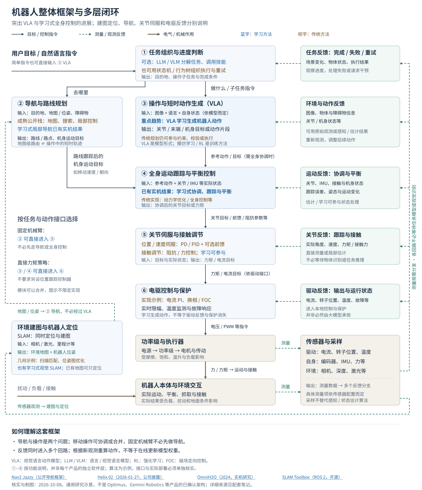

# 机器人整体框架与技术趋势

核实日期：2026-10-08。本文建立通用研究框架，不重建某个厂商的完整内部架构。

## 核心判断

现代机器人的重要变化，不只是用 AI 理解指令，而是**让学习模型生成动作，并进一步承担全身运动跟踪与平衡控制**。VLA 是其中一条明确的发展路线，但不能把它理解成已经统一取代导航、关节伺服和电驱控制的单一模型。

## 整体框架：先分清四个问题

- **环境是什么、我在哪：建图与定位。** 同时定位与建图（Simultaneous Localization and Mapping，SLAM）根据相机或激光等观测，联合估计环境地图与机器人位姿（位置和朝向）；已有地图时可以只做定位。里程计提供连续的局部运动估计，地图定位帮助纠正漂移。输出是空间信息，不是电机动作。[Nav2 Jazzy 状态估计文档](https://docs.nav2.org/jazzy/getting_started/navigation_concepts/state_estimation/)
- **去哪里：导航与路线规划。** 目的地、地图、定位和障碍物信息，变成路线、路点或机身运动目标。地图级路由与拿取物体时的短时动作轨迹不是同一个问题。
- **做什么动作：操作与短时动作生成。** 视觉语言动作模型（Vision-Language-Action，VLA）根据图像、语言及相关状态生成动作。输出可以是关节目标、末端目标或动作片段，物理含义取决于模型和机器人配置；不是统一格式的“电机指令”。[openpi 的公开接口](https://github.com/Physical-Intelligence/openpi/blob/main/docs/remote_inference.md)返回形状为 `(action_horizon, action_dim)` 的动作片段（代码文档，main 分支，核实于上述日期）。
- **怎样稳定执行：全身协调、关节跟踪与驱动。** 需要全身运动时，跟踪器结合实际状态协调手、脚和躯干；之后按动作接口进行关节伺服或接触调节，再由驱动器产生电气输出。固定机械臂可以不经过全身跟踪；直接力矩策略也可以不另设位置跟踪层。

图中的任务组织、导航和全身跟踪并非必选的独立模块。简单自然语言指令可以直接交给 VLA；复杂任务可以另用视觉语言模型（VLM）组织步骤、调用 VLA 或导航工具。**实际运动与指令会有偏差，传感器反馈应进入相关回路，而不是只返回给一个“大模型”。**

## 阶段性进展：哪些已经有实际结果？

### 1. VLA：从操作动作生成，向移动与全身操作扩展

**公开披露｜公司技术介绍与评测。** Google 的 [Gemini Robotics 2（2026-07-30）](https://deepmind.google/blog/gemini-robotics-2-brings-whole-body-intelligence-to-robots/)展示了把行走、弯腰和操作结合的任务；ER 2 负责多步任务组织，与 VLA 配合。方向已不局限于固定机械臂，但这不证明通用长距离导航或全部控制细节都被同一个模型吸收。

VLA 描述模型的输入输出，模仿学习（Imitation Learning）和强化学习（Reinforcement Learning，RL）描述训练方式，可以结合使用。预训练、演示学习和后续改进可以组合，不能默认每个 VLA 都采用完整的三阶段训练。

### 2. 学习式全身控制：已有实机效果，不只是概念

**公开披露｜公司技术说明。** [Figure Helix 02（2026-01-27）](https://www.figure.ai/news/helix-02)明确区分 S1 的全身关节目标与 S0 的学习式跟踪、协调和平衡，提供了“动作生成 → 学习式全身控制”的具体例子。

**公开披露｜论文与开源实现。** [OmniH2O（CoRL 2024）](https://omni.human2humanoid.com/)提供实机跟踪实验与代码，说明这一方向可以验证；其[论文 §3](https://arxiv.org/html/2406.08858v1)明确写出“学习策略输出目标关节角度 → PD 控制器驱动电机”。**学习了全身运动，不等于取消关节反馈控制。** 这些结果也不自动证明任意接触任务的精度或长期生产可靠性。

### 3. 建图、定位与导航：空间估计与运动规划分开说明

**公开披露｜开源算法。** [SLAM Toolbox（ROS 2 分支）](https://github.com/SteveMacenski/slam_toolbox)通过扫描匹配估计运动、累积观测建图；发现重访旧地点（回环）时，优化位姿图以纠正漂移。[DROID-SLAM（2021，开源）](https://github.com/princeton-vl/DROID-SLAM)则提供学习式视觉 SLAM。几何与学习方法都能参与空间估计，不能默认这部分已被 VLA 取代。

**公开披露｜官方框架文档。** [Nav2 Jazzy](https://docs.nav2.org/jazzy/getting_started/navigation_concepts/navigation_servers/)把全局路径规划与局部路径跟随分开；其[算法插件](https://docs.nav2.org/jazzy/configuration_and_development/navigation_plugins/)包含 A*、Dijkstra 和局部优化控制。这是可检查的成熟实现，不是所有厂商技术栈的统计结论。

**公开披露｜实机研究。** [NoMaD（ICRA 2024）](https://general-navigation-models.github.io/nomad/)已经验证学习式视觉局部导航与避障，但仍结合拓扑图处理较长距离的目标。因此，“模型做导航还只是概念”和“模型已全面取代传统导航”都不准确。

## 对传统控制与 Optimus 的判断

**工程判断：替代多少，要沿动作接口追踪。** VLA 可以替代部分显式的操作动作规划；如果输出关节位置，后续仍需解决位置跟踪；如果输出力矩，控制链又不同。PD、PID、动力学前馈、阻抗控制和电流 PI 是不同选择，不应全部简称为 PID。端到端策略也不自动意味着电驱反馈、限幅与故障保护消失。

**公开披露｜招聘方向，非部署证明。** Tesla 的[全身控制强化学习岗位（职位 244485，发布日期未注明）](https://www.tesla.com/en_CA/careers/search/job/reinforcement-learning-engineer-locomotion-optimus--244485)描述了行走、平衡、抗扰与操作策略研发。本次主要取得官方页面索引正文，证据只支持研发方向。

**未确认。** 现有公开资料不足以确定 Optimus 是否部署 VLA 及其具体输入输出，也不足以确定导航实现及关节／驱动控制算法，不能把上图或其他公司的架构直接套上去。进一步证据与限制见 [Optimus：AI 与传统控制](optimus-ai-control-overall.md)。

下一步优先追踪一个可公开验证的接口：**动作片段 → 关节目标 → 反馈跟踪 → 实际运动**，再用小规模实验理解误差、扰动和执行器限幅，而不是先猜闭源系统的全部细节。
